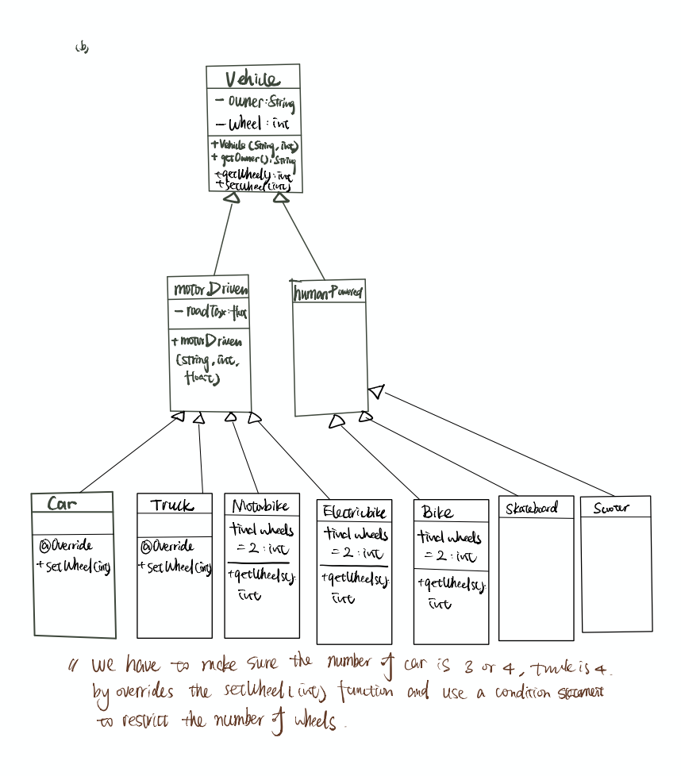

### Q23. (W) Explain the result of the following code.
``` java
public static void add(int[] xy,int dx, int dy) {
xy[0]+=dx;
xy[1]+=dy;
}
public static void add(int x,int y,int dx, int dy) {
x=x+dx;
y=y+dy;
}
public static void main(String[] args) {
int xypair[] = {1,1};
add(xypair[0], xypair[1], 1, 1);
System.out.println(xypair[0]+" "+xypair[1]);
add(xypair,1,1);
System.out.println(xypair[0]+" "+xypair[1]);
}
```
* When calling the Java functions, the arguments are passed by value: the primitive types are passed by their actual value while the reference types are passed by their value of the reference, not the actual data stored on the heap.
* `xypair` is a reference type while `xypair[0]` is the data stored one the heap pointed by the reference at index 0, so it is an actual value.
* The first command `add(xypair[0], xypair[1], 1, 1)`: all the arguments are primitive types, so the actual value stored on the heap which is pointed by the reference are not changed. So the result of the first print command is `1 1`.
* The second command `add(xypair,1,1)`: since the add function is overloaded, in this case, we passed a reference type and two primitive types to the overloaded add function. We have modified the value stored on the heap because the reference type passed to the function points to the same data stored on the heap. So the output of the second print statement is `2 2`.

``` 
// Comments:


```

### Q24. (W) A student wishes to create a class for a 3D vector and chooses to derive from the Vector2D class (i.e. public void Vector3D extends Vector2D). The argument is that a 3D vector is a “2D vector with some stuff added”. Explain the conceptual misunderstanding here.
* Parent class and child class have an "is a" relationship, since the 3D vector is not a 2D vector, we cannot treat the 3D vector class as a subclass of the 2D vector class.
* The purpose of inheritance is to reuse a similar block of codes and boost efficiency. Child class needs to inherit fields and methods from its parent class. The Child class can overwrite the functions and add more fields. However, in the case of the 3D vector, it needs to rewrite every function (i.e., add, multiply, subtract, inverse, transpose etc), so extending from the Vector2D class will bring minimal benefits.
* 3D vector and 2D vector are both belong to the vector interface, and they are siblings rather than parent and child.

```
// Comments:


```

### Q25. (W) If you don’t specify an access modifier when you declare a member field of a class, what does Java assign it? Demonstrate your answer by providing minimal Java examples that will and will not compile, as appropriate.
* Java will specify it as `package` which means the files in the same package can have access to this particular member field.
* Suppose we have 3 classes, one called "Bicycle" and has a "colour" fields that is has no access modifier specified. The second is under the same package as "Bicycle", the third one is under a different package of "Bicycle".
* The main method in the `GetColour` class will compile while the main method in the `GetColour2` class will not compile. The reason is that the second class in not in the same package as the `Bicycle` class, thus it has no access authorities to the fields with a package access modifier, that is, the `color` field in the `Bicycle` class.

```java
// file1: Bicycle
package bicycle;
public class Bicycle {
    String colour = "Green";
    Bicycle(){
    // ...
    }
}
```
```java
// file2: GetColour
package bicycle;
public class GetColour {
    public static void main(){
    Bicycle myBike = new Bicycle();
    System.out.println(myBike.colour);
    }
}
```
```java
package car;
public class GetColour2 {
    public static void main(){
    Bicycle myBike = new Bicycle();
    System.out.println(myBike.colour);
    }
}
```
```
// Comments:


```
### Q26. Suggest UML class diagrams that could be used to represent the following. Think carefully about the directions of and multiplicities on your arrows.
(a) A shop is composed of a series of departments, each with its own manager. There is also a store
manager and many shop assistants. Each item sold has a price and a tax rate.


(b) Vehicles are either motor-driven (cars, trucks, motorbikes, electric bikes) or human-powered (bikes,
skateboards,scooters). All cars have 3 or 4 wheels and all bikes have two wheels. Every vehicle has
an owner. Some vehicles must have road tax.



``` java
// Comments:


```

### Q27. Consider the Java class below:
``` java
package questions;
public class X {
MODIFIER int value = 3;
};
```
Another class Y attempts to access the field value in an object of type X. Describe what happens at
compilation and/or runtime for the range of MODIFIER possibilities (i.e. public, protected, private and
unspecified) under the following circumstances:

(a) Y subclasses X and is in the same package;
* `public`: No compile error or runtime error.
* `protected`: No compile error or runtime error since Y is the subclass of X and they are in the same package.
* `private`: Compile time and runtime error, because private fields can only be accessed within the same class.
* `unspecified(package)`: No compile error or runtime error since Y and X are in the same package.

(b) Y subclasses X and is in a different package;
* `public`: No compile error or runtime error.
* `protected`: No compile error or runtime error since Y is the subclass of X
* `private`: Compile time and runtime error, because private fields can only be accessed within the same class.
* `unspecified(package)`: Compile time and runtime error, because Y and X are not in the same package.

(c) Y does not subclass X and is in the same package;
* `public`: No compile error or runtime error.
* `protected`: No compile error or runtime error since Y and X are in the same package.
* `private`: Compile time and runtime error, because private fields can only be accessed within the same class.
* `unspecified(package)`: No compile error or runtime error since Y and X are in the same package.

(d) Y does not subclass X and is in a different package.
* `public`: No compile error or runtime error.
* `protected`: Compile time and runtime error, because Y and X are not in the same package and Y is not a subclass of X.
* `private`: Compile time and runtime error, because private fields can only be accessed within the same class.
* `unspecified(package)`: Compile time and runtime error, because Y and X are not in the same package.

```
// Comments:


```

### Q28. (W) Explain what is meant by (dynamic) polymorphism in OOP and explain why it is useful, illustrating your answer with an example.
* Dynamic polymorphism means the value and variables will have multiple types, and the types are determined at run-time.
* Why useful?
    + We can use dynamic polymorphism in collections. We can iterate through a collection of objects from different classes but inherit the same parent class/interface and invoke the same method. Thus, it prevents us from rewriting the same method for each object.
    + More flexible API. We can create a method which expects a single interface and pass different objects to the method to invoke various overriding methods.
```java
public class Test {
public class Dance{
       public static void dance(){
           System.out.println("Dance");       
       }
   };  

public class Jazz extends Dance{
    public static void dance(){
        System.out.println("Jazz");       
    }
};  
public class Pop extends Dance{
    public static void dance(){
        System.out.println("Pop");       
    }
};
public static void startDance(Dance dancer){
    dancer.dance();
}
public static void main(String[] args){
  Dance dancer1 = new Dance();
  Dance dancer2 = new Jazz();
  Dance dancer3 = new Pop();
  // First advantage:
  ArrayList<Dance> danceList = new ArrayList<>({dancer1,dancer2,dancer3});
  for (Dance item:danceList){
      item.dance();
  }
  // Second advantage:
  dancer1.startDance();
  dancer2.startDance();
  dancer3.startDance();
}
}
```
```
// Comments:


```

### Q29. A programming language designer proposes adding ‘selective inheritance’ whereby a programmer manually specifies which methods or fields are inherited by any subclasses. Comment on this idea.
* Advantage:
    * Less classes needed because we can construct a general class and select fields or methods from it to form our different subclasses.
* Disadvantage:
    * We need to handle more exceptions if the subclass accidentally try to access the fields or methods that they are not allowed to.
    * Violates the idea of encapsulation because the fields and methods are separated by the selective inheritance.
    * If we want to inherit an additional field or method from the superclass, we have to manually permit that field or method to be inherited.
    * Different subclasses might inherit different fields or methods from the superclass, with selective inheritance, programmers should specify the particular fields or methods each subclass is allowed to inherit in the superclass, which is cumbersome and error prone.
    * We can achieve the same effect by using a chain of interfaces and classes.
```
// Comments:


```

### Q30. A Computer Science department keeps track of its CS students using some custom software. Each student is represented by a Student object that features a pass() method that returns true if and only if the student has all 20 ticks to pass the year. The department suddenly starts teaching NS students, who only need 10 ticks to pass. Using inheritance and polymorphism, show how the software can continue to keep all Student objects in one list in code without having to change any classes other than Student.
```java
public class Student{
    int numTick;
    int passNumTick=20;
    Student(int numTick){
        this.numTick = numTick;
    }
    // overloading the constructor to allow a change in the number of the ticks for a pass
    Student(int numTick, int passNumTick){
        this.numTick = numTick;
        this.passNumTick = passNumTick;
    }
    boolean pass(){
        return numTick >= passNumTick;
    }
}
public class NatsciStudent extends Student{
    NatsciStudent(int numTick){
        super(numTick,10);
    }
    boolean pass(){
        return Student.this.numTick >= Student.this.passNumTick;
}
}
```
* initialise the field `passNumTick` with 20 and use this field in the `pass()` method so that all the CST student object won't be affected.
* Overload the constructor of the `Student` class so that we can pass an additional argument to change the number of the ticks needed for a pass for the NST students.
* Construct a new class called `NatsciStudent` to override the `pass` method. 

```
// Comments:


```

### Q31. Complete the Chess practical exercise on Chime

[Chess program on Chime](https://chime.cl.cam.ac.uk/page/repos/yz709/chess/code/2c41a05381d39018505f998ba1c577e296cc16a3)

(a) Which are the parts of the program which are poorly designed with switch statements for pieces?
 
   * Poorly designed parts:
        * `icon()`, `value()` `validNextPositions()` are poorly designed as they contain switch statements that switches based on the name of the pieces.
    
(b) In what ways is your new code easier to maintain than previously? What drawbacks have arisen from
   this new approach?
   
   * Advantages:
        * The `Piece` class is shorter and much easier to be maintained.
        * The implementation details can be better encapsulated for each piece because we do not need to write all of them in the `Piece` class.
        * Dynamic Polymorphic can be implemented in the methods so that compiler will check the type of the piece at run-time while regards all pieces as `Piece` type at compile-time.
        * Easier to iterate through a collection of pieces and invoke the overloading methods.
        * We can add more pieces easily if the chess game is going to be modified. This is because the methods can be override in each piece class rather than adding switch statements in each function in the `Piece` class.
   
   * Disadvantages:
        * More classes need to be added (i.e., one for each piece), the same method signature needs to be written multiple times.
        * More repeated codes in an overloading method. If there are some codes applied to all pieces in a method, then when we are writing overloading methods, we have to include those codes. For instance, in the `icon()` function, the `colourSwitch` statement needs to be written in every version of the overriding method.
```
// Comments:


```

### Q32. In the second of the shape drawing examples in lectures, we relied on the existence of an instanceof operator that allowed us to check which class the object really was. The built-in ability to do this is called reflection. However, not all OOP languages support reflection. Show how we could modify the shape classes to allow us to determine the true type without using reflection.
* Use dynamic polymorphic. Treat each object as an object of the shape superclass and then let the compiler to determine which subclass it belongs to at runtime.
* In the main function, we want to invoke the draw method for each shape. At compiler time, compiler will treat each object as an object in the Shape superclass, but at run time, it will examine the type of the object and invoke the correct overridden method in each of the subclasses.
```java
public class Shape{
    int x;
    int y;
    Shape(int x,int y){
    this.x = x;
    this.y = y;
}
    void draw(){
        System.out.println("Shape");           
    }
};
public class Triangle extends Shape{
    Triangle(int x,int y){
    super(x,y);
    }
    void draw(){
        System.out.println("Triangle");   
    }
}
// ...
public static void main(String[] args){
  ArrayList<Shape> shapeList = new ArrayList<>();
  for (Shape s:shapeList){
      s.draw();
  }
}
```
```
// Comments:


```

### Q33. (W) Explain the differences between a class, an abstract class and an interface in Java.
* Fields: Interface can only have static and final fields that are not allowed to be changed; Abstract class and class can have final, non-finanl, static and non-static variables; 
* Methods: Interfaces and abstract class have no detailed implementations for the abstract methods, but abstract class can have non-abstract methods while interfaces can only have abstract methods or final static methods; Class can only have non-abstract methods.
* Access modifiers: Interface only has fields and methods that are public; Abstract class and class can have either private, protected, package or public fields or methods. 
* Multiple inheritance: Interface supports multiple inheritance while class and abstract class does not.
* Inheritance: Abstract class can extends another abstract class or implement multiple interfaces while interface can only implement another interface; Class can extends class(including abstract class) or implement interfaces.
```
// Comments:


```

### Q34. An alternative implementation of a list to a linked list uses an array as the underlying data structure rather than a linked list.
(a) Write down the asymptotic complexities of the array-based list methods.
    
   * `addFirst()`: O(n) because we have to shift all the elements in the arrayedlist to right for 1 position and then add the new element at index 0.
   * `removeFirst()`: O(n) because once we removed the first element, all the following elements need to be shifted left by 1 position.
   * `get()`: O(1) because the items in the arrayedlist are stored in consecutive memory addresses and each item can be fetched in constant time by adding an offset onto the address of the first element.

(b) Complete part 3 of the ‘Classic collections’ (adding interfaces) task on Chime.
   
   [Part3 code on Chime](https://chime.cl.cam.ac.uk/page/repos/yz709/classic_collections_lists_and_queues/code/a0d99d0a3f01b9a57bfe1afbdc89ad647f71107a)
   

(c) When adding items to an array-based list, rather than expanding the array by one each time, the array
size is often doubled whenever expansion is required. Analyse this approach to get the asymptotic
complexities associated with an insertion
   * With insertion operation, when the number of the elements is equivalent to the maximum size of the array, we have to double the size of the array first.
   * In the `doubleSize()` operation, all the original elements are copied to a new array with double the size of the original one, this examines `n` elements in total, this has a time complexity of O(n).
   * After doubling the size, we have to insert the new element into the array, that has a time complexity of O(n) as well because in the worst case, we insert elements in the first index and we have to shift all remaining elements to the right by 1 position.
   * So the total time complexity is O(n) although we have two iteration loops under the worst senario.
   * The reason why we doubling the size rather than incrementing the size by one each time when the array gets full is that if we increment the array by one each time, inserting `n` element will require `n` expanding operations which is ineffective.
```
// Comments:


```

### Q35. (*)
(a) Complete parts 4 and 5 of the ‘Classic collections’ (queues) task on Chime.

[Part 4 Classic collections on Chime](https://chime.cl.cam.ac.uk/page/repos/yz709/classic_collections_lists_and_queues/code/70aa297478c548ce3b13fd98520db1c459307133)

[Part 5 Classic collections on Chime](https://chime.cl.cam.ac.uk/page/repos/yz709/classic_collections_lists_and_queues/code/ddd0aa496b4573fb4b72be6a5df521bdc1a23200)

(b) State the asymptotic complexities of the approach.
* `reverse()` function in part 4:
    * For the `LinkedList` class:
        * We utilise a recursive structure, each time we split the linked list into 2 parts, one with the current first element, while the other part has the rest of the elements. Recursively applying the `reverse()` function until we have one element left, then reverse the link from that element to the previous one. We also have to set the current element to point to null because we need to ensure the tail element should point to null at the end. Another point to bear in mind is to keep track of the new head element so that we can assign head to this new head element in the end.
        * Time complexity is O(n) because we examine all the elements only once and update the links between them along the way.
   
    * For the `ArrayedList` class:
        * We utilise a for loop to copy the elements in the original ArrayedList to a new list but reverse the order.
        * Time complexity is O(n) because we have gone through all the elements one by one in the for loop.
        * Space complexity is O(n) since we need another ArrayedList to store the elements in reverse order.

* The asymptotic complexity of the operations on the queue:
    * `push()`: invokes the `addFirst()` function on the frontList, so it has a time complexity of O(1). However, if the backList is empty, we need to apply the normalise operation which has a time complexity of O(n). Suppose we push n items and pop the n items back, the amortized number of operations still has a time complexity of O(1).
    * `pop()`: invokes the `removeFirst()` function on the backList, so it has a time complexity of O(1). Similarly, if the backList is empty, we need to check the frontList. If the frontList is not empty, then we have to normalise the queue first which has a time complexity of O(n).
    * `normalise()`: reverse the firstList and replace the backList with the reversed firstList. This operation has a time complexity of O(n) because we have to examine all the elements in the firstList and reverse the link between them.
```
// Comments:


```

### Q36. Imagine you have two classes: Employee (which embodies being an employee) and Ninja (which embodies being a Ninja). You need to represent an employee who is also a ninja (a common problem in the real world). By creating only one interface and only one class (NinjaEmployee), show how you can do this without having to copy method implementation code from either of the original classes.
```java
public class Employee{
    void doWork(){
        System.out.println("I am doing work!!");
    }
}
public class Ninja{
    void highJump(){
        System.out.println("I can do High jump");
    }

}
interface combine {
    void doWork();
    void highJump();
}
public class NinjaEmployee implements combine {
    @Override
    void doWork(){
        System.out.println("I can do work much faster than normal homo sapians");
    }

    @Override
    void highJump(){
        System.out.println("I have no time to do high jump because I have loads of work on my desk.");
    }
}
```

* This is a multiple-inheritance problem since the `Ninjaemployee` class needs to inherit from both the `Employee` class and the `Ninja` class.
* This can be implemented by using an interface which wrapped all the methods from the `Employee` class and the `Ninja` class without giveing any implementation details.
* When `Ninjaemployee` class implements the interface `combine`, it needs to override all the methods by providing its own method implementation details.

```
// Comments:


```

### Q37. (W) Write a small Java program that demonstrates constructor chaining using a hierarchy of three classes as follows: A is the parent of B which is the parent of C. Modify your definition of A so that it has exactly one constructor that takes an argument, and show how B and/or C must be changed to work with it.
``` java
package yz709.com.supervision2;

class A {
    private int item;

    A(int item) {
        this.item = item;
        System.out.println("A constructor");
    }
}

class B extends A {
    // since A has a customised constructor, we have to explicitly invoke the
    // super(args list) method
    B(int item) {
        super(item);
        System.out.println("B constructor");
    }

}

class C extends B {
    // Because of constructor chaining, B has a customised constructor hence we have
    // to invoke the super(args list) method in C's construtor as well
    C(int item) {
        super(item);
        System.out.println("C constructor");
    }
}

public class ConstructorChaining {
    public static void main(String[] args) {
        C myC = new C(2);
    }
}

/*
 * 
 * output:
 * 
 * A constructor 
 * B constructor 
 * C constructor
 * 
 */


```

* When we call the constructor of `C` in the `main()` method, the constructor of `C` is invoked
* Since class `C` inherits class `B`, we have to invoke the `super(int item)` method first to call the constructor of class `B`.
* Similarly, class `B` inherits from class `A`, so we have to explicitly call the class `A` constructor using the `super(int item)` procedure.
* The constructor of `A` runs and print the statement `A constructor`.
* Then the constructor of `B` runs and print the statement `B constructor`.
* Finally the constructor of `C` runs and print `C constructor`.

```
// Comments:


```

### Q38. The lectures described the main mechanism to mark objects that can be deleted (or to mark objects that cannot be deleted), but not the deletion process. Compare and contrast the following approaches in terms of performance. Your answer should consider the costs associated with marking and deleting.
(a) The mark-sweep schemes delete the marked objects, leaving their memory available. A list of free memory chunks is maintained.

(b) The mark-sweep-compact schemes delete the objects and then compact the memory by moving surviving objects to be adjacent to each other (i.e. no free memory between them).

(c) The mark-copy schemes maintain two memory regions, one of which is active. During the marking process, surviving objects are copied into the other region. Once marking is complete, references are upated to the second region, which becomes active, and the first region is deleted.

* The (a) choice: The time complexity for marking is `O(n)` as we have to trace all the objects one by one. Keeping a list of memory can be effective in term of time complexity because when an object is deleted, it requires `O(1)` operation to add the address onto the list. However, we have to utilise some extra memory to store the list of the free memory chunk addresses. When there are a lot of free memory chunk addresses, the space requirement is big.
* The (b) choice: Despite the time complexity for marking which is `O(n)` since we have to go through all the objects, the deleting procedure is costly as well. Suppose we have a list of memory which has been used, if one object is deleted, then that particular memory space becomes free and we have to shift the used memory up by one. This give us a time complexity of `O(n)` in the worst case where the first memory space is being freed and all the following memory contents have to be copied int to the previous chunk. The space complexity depends on the amount of memory chunks used, which is the opposite to the space complexity of (a) choice.
* The (c) choice is not efficient when there are many surviving objects, because we have to mark and copy all the surviving objects into the other region, in the worst case, this will give a time complexity of `O(n)` if all objects are still surviving. We have to update each reference as well after copying all the surviving objects into the active memory region, which takes `O(n)` in the worst case as we have to iterate through all object references and update each one in turn.
 
```
// Comments:


```

### Q39. It is often recommended that we make classes immutable wherever possible. How would you expect this to impact garbage collection?
* This will improve the efficiency of the garbage collection process and reduce garbage collection overhead as less memory is required to allocate immutable classes if multiple objects are created.
* If all the classes are immuatble, no other classes can inherit from them, so the immuatable class can be safely shared among objects, that is, there will be less memory allocation required.

```
// Comments:


```

### Q40. What are the issues with using finalizers?
* There is no guarantee that the `finalizer` method will run in the program;
* We are not clear about the timeline of the `finalizer` so that gives the programmer less control and might break down the program unexpectly if the object if unexpectly unreachable and the `finalizer` runs to destruct the object.
* We may run out of resources before a clean-up happens if a thread keeps producing obejcts at high speed and the `Finalizer` cannot keep up, which eventually cause `OutOfMemoryError`.
* Finalizer will impact the program's portability because the garbage collection algorithm is `JVM` implementation-dependent, a program may run very well on one system while having problems on the other
* There is a performance cost involved when an object has a `Finalizer` attached, because `JVM` have to perform more operations when constructing and destructing the object containing a non-empty `Finalizer`.
* The lack of exception handling during `Finalization` leads to a case that when a `finalizer` throws an exception and the finalization process stops, this leaves the object in a corrupted state without any notification.

```
// Comments:


```

### Q41. (*) In Java try...finally blocks can be applied to any code—no catch is needed. The code in the finally block is guaranteed to run after that in the try block. Suggest how you could make use of this to emulate the behaviour of a destructor (which is called immediately when indicate we are finished with the object, not at some indeterminate time later).

```java
import java.io.Closeable;
import java.io.IOException;

class myClass implements Closeable {
    private int item;

    myClass(int item) {
        this.item = item;
    };

    public void call() {
        System.out.println(item);
    }

    @Override
    public void close() throws IOException {
        System.out.println("Closed");

    }
}

public class DestructorWithTryFinally {
    public static void main(String[] args) throws IOException {
        myClass a = new myClass(1);
        try {
            a.call();
        } finally {
            a.close();
        }
    }
}
```


```
// Comments:


```

### Q42. By experimentation or otherwise, work out what happens when the following method is executed
```java
public static int x() {
try {return 6;}
finally { ... }
}
```

* When we call the method `x()`, the try block gets executed but before returning the result, it executes the finally block and in this case print the statement `finally block`.
* After the finally block is being executed, the method returns back the result `6` to the `main()` method.
``` java
public class Main {

    public static int x() {
        try {
            return 6;
        } finally {
            System.out.println("finally block");
        }
    }

    public static void main(String[] args) {
        System.out.println(x());
    }
}

```

```
// Comments:


```

### Q43. What would you say are the three most important concepts from the content for this supervision?
* The difference of Abstract class and interface and why we need interface
* Subtype polymorphism
* The chained object initialization
   
### Q44. Give one question that you would like to discuss in the supervision.
* What is the difference between late-binding and reflection?